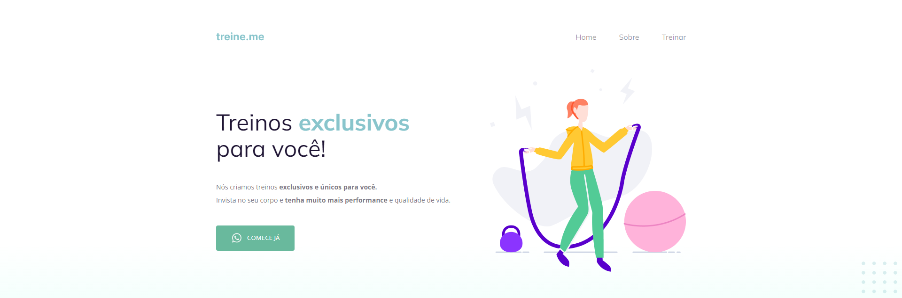

# Projeto 02

> Curso Explorer - Turma 06

Projeto de uma página fictícia de exercícios, construído no curso Explorer da Rocketseat

🔗[Clique aqui para acessar](https://benedirgomesneto.github.io/Projeto02/)

## 🛠 Tecnologias

- HTML
- CSS
- Git e Github

## 💛 Contato

benedirgomesneto@gmail.com
